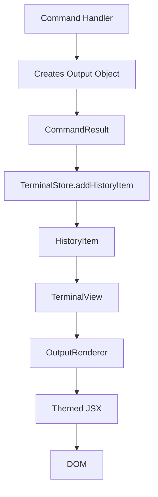

# Declarative Output System Implementation Plan

## Overview

This plan outlines the implementation of a declarative output system for the Terminus terminal framework. The new system will separate the intent (declarative output description) from the implementation (imperative rendering), making commands cleaner and the rendering more centralized and themeable.

## Current Architecture Analysis

### Current State

- Commands return `CommandResult` objects with `success: true/false` and `output/error` as React nodes
- Commands directly create JSX elements with theme classes (e.g., `<p className={context.theme.textError}>`)
- The `TerminalView` component renders `HistoryItem` objects that contain React nodes directly
- Theme system provides CSS classes for different text types (textPrimary, textError, etc.)

### Target Architecture

- Commands return declarative `Output` objects describing the intent
- A centralized `OutputRenderer` converts these objects to themed JSX
- All styling decisions are made in one place
- Commands become cleaner and more focused on logic

## Implementation Phases

### Phase 1: Core Types and Interfaces

1. **Define OutputType enum**

   - Values: TEXT, SUCCESS, ERROR, WARNING, CODE, LIST, TABLE, JSON, MARKDOWN, CUSTOM
   - Purpose: Identify the type of output for proper rendering

2. **Create Output interface**

   - Properties: `type` (OutputType), `content` (various types based on output type), `config` (optional styling/configuration)
   - Support different content types: string, ReactNode, array objects, JSON data, etc.

3. **Update CommandResult type**
   - Replace ReactNode with Output object in success/error properties
   - Maintain the same structure but with declarative content

### Phase 2: Rendering System

1. **Create OutputRenderer component**

   - Converts Output objects to themed JSX
   - Handles different output types with appropriate styling
   - Integrates with existing theme system

2. **Create helper functions**

   - `printLine(content, config?)` - TEXT type
   - `printError(content, config?)` - ERROR type
   - `printSuccess(content, config?)` - SUCCESS type
   - `printWarning(content, config?)` - WARNING type
   - `printCode(content, config?)` - CODE type
   - `printList(items, config?)` - LIST type
   - `printTable(data, config?)` - TABLE type
   - `printJson(data, config?)` - JSON type
   - `printMarkdown(content, config?)` - MARKDOWN type

3. **Update CommandContext**
   - Include helper functions for creating output objects
   - Provide easy access to the new declarative API

### Phase 3: Data Flow Updates

1. **Create OutputHistoryItem type**

   - Store Output objects in history instead of React nodes
   - Maintain command string and output object

2. **Update TerminalStore**

   - Modify `addHistoryItem` to accept Output objects
   - Update internal state structure
   - Ensure backward compatibility during transition

3. **Update TerminalView**
   - Use OutputRenderer for displaying output
   - Maintain existing UI structure
   - Handle different output types appropriately

### Phase 4: Command Migration

1. **Update calculator.tsx**

   - Replace JSX creation with Output objects
   - Use helper functions for consistent output
   - Maintain existing functionality

2. **Update help.tsx**

   - Convert complex JSX structures to Output objects
   - Use LIST and TEXT types appropriately
   - Maintain rich formatting capabilities

3. **Update echo.tsx**

   - Simple text output using TEXT type
   - Handle uppercase transformation in content

4. **Update theme.tsx**
   - Update theme switching messages
   - Use appropriate output types for feedback

### Phase 5: Testing and Documentation

1. **Test all commands**

   - Ensure functionality is preserved
   - Verify proper theming
   - Test edge cases

2. **Update documentation**
   - Provide examples of new API usage
   - Document available output types
   - Explain benefits of declarative approach

## Architecture Benefits

### 1. Separation of Concerns

- Commands declare intent (what to output)
- Renderer handles presentation (how to output)
- Clear separation between business logic and presentation logic

### 2. Centralized Theming

- All styling decisions made in one place
- Consistent application of themes across all commands
- Easier to modify and extend styling

### 3. Extensibility

- Easy to add new output types
- Custom renderers for specific needs
- Plugin architecture for output formatting

### 4. Consistency

- All commands follow the same output pattern
- Standardized error and success messages
- Consistent user experience

### 5. Maintainability

- Easier to modify styling across the entire application
- Clear structure makes debugging easier
- Reduced code duplication in commands

## Implementation Flow



## Detailed Task List

### Core Types and Interfaces

- [ ] Define OutputType enum with values: TEXT, SUCCESS, ERROR, WARNING, CODE, LIST, TABLE, JSON, MARKDOWN, CUSTOM
- [ ] Create Output interface with type, content, and optional styling/config properties
- [ ] Update CommandResult type to use Output objects instead of React nodes

### Rendering System

- [ ] Create OutputRenderer component that converts Output objects to themed JSX
- [ ] Create helper functions: printLine, printError, printSuccess, printWarning, printCode, printList, printTable, printJson, printMarkdown
- [ ] Update CommandContext to include helper functions for creating output objects

### Data Flow Updates

- [ ] Create a new OutputHistoryItem type to store output objects in history
- [ ] Update TerminalStore to handle Output objects in history
- [ ] Update TerminalView to use OutputRenderer for displaying output

### Command Migration

- [ ] Update calculator.tsx commands to use the new declarative API
- [ ] Update help.tsx to use the new declarative API
- [ ] Update echo.tsx to use the new declarative API
- [ ] Update theme.tsx to use the new declarative API
- [ ] Remove backward compatibility layer (complete replacement)

### Documentation

- [ ] Update documentation and examples

## Example Usage

### Before (Current)

```typescript
return {
  success: true,
  output: (
    <p className={context.theme.textPrimary}>Result: {formattedResult}</p>
  ),
};
```

### After (New)

```typescript
return {
  success: true,
  output: printSuccess(`Result: ${formattedResult}`),
};
```

### Complex Example

```typescript
return {
  success: true,
  output: printList([
    { content: "Item 1", type: "success" },
    { content: "Item 2", type: "warning" },
    { content: "Item 3", type: "error" },
  ]),
};
```

## Content and Configuration Types

To ensure clarity and consistency in the implementation, the specific types for `content` and `config` for each `OutputType` are defined as follows:

### OutputType.TEXT, SUCCESS, ERROR, WARNING, CODE, MARKDOWN

- `content`: `string`
- `config`: `{ styleType?: 'textPrimary' | 'textSecondary' | 'textSuccess' | 'textError' | 'textWarning' | ... ; className?: string; }`
  - `styleType`: Maps to theme-provided styles (e.g., `textPrimary` -> `context.theme.textPrimary`).
  - `className`: Allows for additional custom classes.

### OutputType.LIST

- `content`: `Array<{ content: string; type?: 'success' | 'warning' | 'error' | 'default'; styleType?: string; className?: string; }>`
  - An array of list item objects.
  - `content`: The text for the list item.
  - `type`: Optional semantic type for the item, potentially influencing default styling.
  - `styleType` / `className`: Optional item-specific styling.
- `config`: `{ ordered?: boolean; itemStyleType?: string; itemClassName?: string; }`
  - `ordered`: If `true`, renders an `<ol>`; otherwise, a `<ul>`.
  - `itemStyleType` / `itemClassName`: Default styles for all list items.

### OutputType.TABLE

- `content`: `{ headers: string[]; rows: string[][]; }`
  - `headers`: An array of column header strings.
  - `rows`: An array of rows, where each row is an array of cell strings.
- `config`: `{ headerStyleType?: string; rowStyleType?: string; cellStyleType?: string; className?: string; }`
  - Styling options for headers, rows, and cells.

### OutputType.JSON

- `content`: `any` (The raw data to be JSON stringified).
- `config`: `{ pretty?: boolean; indentSize?: number; className?: string; }`
  - `pretty`: If `true`, formats the JSON with indentation.
  - `indentSize`: Number of spaces for indentation if `pretty` is true.

### OutputType.CUSTOM

- `content`: `React.ReactNode` (Direct JSX, for maximum flexibility when predefined types aren't suitable).
- `config`: `{ className?: string; }`

## Success Criteria

1. All existing commands work with the new system
2. Output is properly themed according to the current theme
3. Commands are cleaner and more focused on business logic
4. New output types can be easily added
5. The system is maintainable and extensible
6. Documentation provides clear examples and usage guidelines

## Migration Strategy

The migration will be performed in a carefully orchestrated phased approach to minimize risk and ensure system stability throughout the transition. This strategy focuses on maintaining functionality at each step while gradually migrating to the new declarative system.

### Phase 1: Foundation Building (Zero Risk)

**Goal**: Establish the new types and interfaces without affecting existing functionality

**Steps**:

1. **Define OutputType enum** and **Output interface** in `types.ts`
2. **Create OutputRenderer component** but keep it dormant initially
3. **Add helper functions** to CommandContext but mark them as optional
4. **No breaking changes** to existing command signatures or return types

**Risk Level**: None - existing code continues to work unchanged

### Phase 2: Dual-Mode Data Layer (Low Risk)

**Goal**: Enable the new system while maintaining full backward compatibility

**Steps**:

1. **Update TerminalStore** to accept both old (ReactNode) and new (Output) formats
2. **Create OutputHistoryItem type** alongside existing HistoryItem
3. **Update TerminalView** to detect format and route to appropriate renderer
4. **Add format detection logic** in store methods

**Implementation**:

```typescript
// Store method example
addHistoryItem: (
  command: string,
  output: React.ReactNode | Output,
  type = "standard"
) => {
  if (isOutputObject(output)) {
    // New format: store as OutputHistoryItem
    set((state) => ({
      history: [
        ...state.history,
        { id: state.history.length, command, output, type },
      ],
    }));
  } else {
    // Old format: convert to Output object for consistency
    const outputObj: Output = {
      type: "text",
      content: output as React.ReactNode,
    };
    set((state) => ({
      history: [
        ...state.history,
        { id: state.history.length, command, output: outputObj, type },
      ],
    }));
  }
};
```

**Risk Level**: Low - graceful fallback ensures no functionality is lost

### Phase 3: Progressive Command Migration (Medium Risk)

**Goal**: Migrate commands to use the new API while maintaining system stability

**Migration Order** (simplest to most complex):

1. **echo.tsx** - Simple text output
2. **theme.tsx** - Basic feedback messages
3. **calculator.tsx** - Mathematical results with formatting
4. **help.tsx** - Complex structured output

**Per-Command Migration Process**:

```typescript
// Before (old way)
return {
  success: true,
  output: <p className={context.theme.textPrimary}>Result: {value}</p>,
};

// After (new way)
return {
  success: true,
  output: printSuccess(`Result: ${value}`),
};
```

**Validation Steps**:

1. **Manual testing** of the specific command
2. **Theme verification** - output appears correctly in all themes
3. **Edge case testing** - error handling, empty inputs, etc.
4. **Regression testing** - ensure no other commands are affected

**Risk Level**: Medium - isolated changes with thorough testing

### Phase 4: System Integration (Medium Risk)

**Goal**: Complete the migration and remove legacy code

**Steps**:

1. **Update all remaining commands** to use the new API
2. **Enable OutputRenderer** as the primary rendering system
3. **Remove legacy rendering paths** from TerminalView
4. **Update CommandContext** to require helper functions

**Implementation**:

```typescript
// TerminalView updates
const renderHistoryItem = (item: HistoryItem) => {
  if (isOutputObject(item.output)) {
    return <OutputRenderer output={item.output} theme={currentTheme} />;
  } else {
    // Legacy path - should not exist after migration
    console.warn("Legacy output format detected");
    return (
      <div className={item.type === "error" ? theme.textError : ""}>
        {item.output}
      </div>
    );
  }
};
```

**Risk Level**: Medium - system-wide changes but well-tested components

### Phase 5: Cleanup and Optimization (Low Risk)

**Goal**: Remove legacy code and finalize the implementation

**Steps**:

1. **Remove all backward compatibility code**
2. **Update TypeScript types** to enforce new API
3. **Optimize OutputRenderer** for performance
4. **Update documentation** and examples

**Code Cleanup**:

```typescript
// Remove old types
// type OldCommandResult = { success: true; output: React.ReactNode } | { success: false; error: React.ReactNode };

// Enforce new types
type CommandResult =
  | { success: true; output: Output }
  | { success: false; error: Output };
```

**Risk Level**: Low - cleanup only, no functional changes

## Risk Mitigation Strategy

### 1. Branching Strategy

- **Main branch**: Always contains working code
- **Feature branches**: Each phase gets its own branch
- **Hotfix branches**: For critical issues during migration

### 2. Testing Strategy

- **Unit tests**: For each helper function and renderer
- **Integration tests**: For command-output-renderer flow
- **E2E tests**: For complete command workflows
- **Visual regression tests**: For theme consistency

### 3. Monitoring Strategy

- **Console warnings**: For legacy format detection
- **Error boundaries**: To catch rendering issues
- **Performance metrics**: To track any regressions
- **User feedback channels**: For real-world issue reporting

### 4. Rollback Strategy

- **Database migration**: Store history in both formats initially
- **Feature flags**: To toggle between old and new rendering
- **Automated rollback**: Script to revert to previous commit
- **Documentation**: Clear rollback procedures for each phase

### 5. Communication Strategy

- **Change log**: Document all breaking changes
- **Migration guide**: For developers using the framework
- **Version bumping**: Major version for breaking changes
- **Deprecation notices**: Clear timeline for removing old API

## Success Metrics

### Functional Metrics

- [ ] All existing commands work identically to before
- [ ] New output types render correctly in all themes
- [ ] No console warnings or errors during normal operation
- [ ] Performance is equal to or better than the old system

### Code Quality Metrics

- [ ] Code complexity is reduced in command handlers
- [ ] Test coverage maintains or improves
- [ ] Type safety is enforced throughout the system
- [ ] Documentation is complete and up-to-date

### User Experience Metrics

- [ ] Output appearance is consistent across commands
- [ ] Theme changes apply correctly to all output types
- [ ] No visual regressions or layout issues
- [ ] Error messages are clear and consistent
